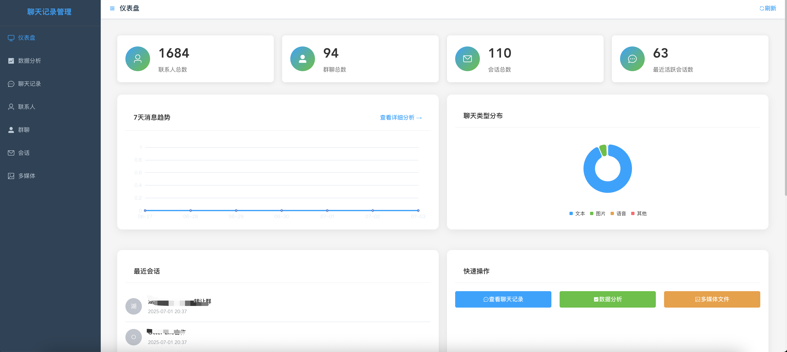
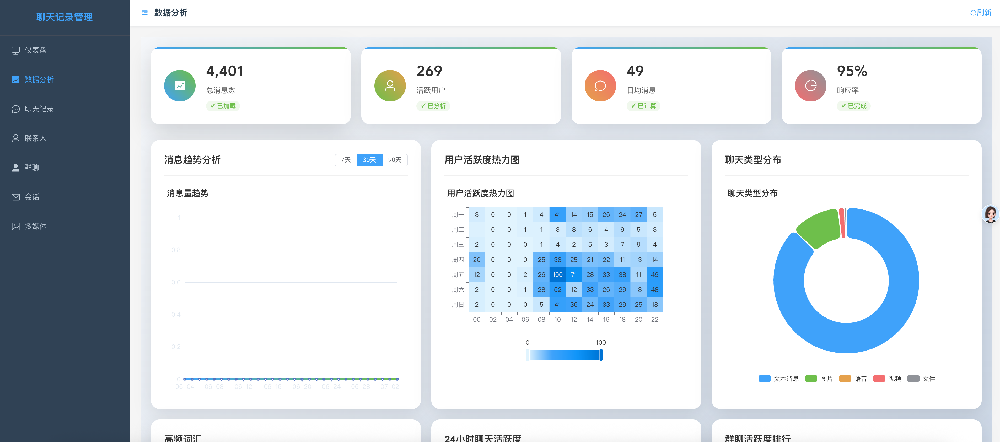

# Chatlog Web

<div align="center">


**基于 Vue.js 的聊天记录可视化管理系统**

[](https://vuejs.org/)
[](https://element-plus.org/)
[](https://echarts.apache.org/)
[](LICENSE)

[English](README_EN.md) | 简体中文

</div>

## 📖 项目简介

Chatlog Web 是 [chatlog](https://github.com/sjzar/chatlog) 项目的现代化 Web 管理界面，提供了强大的聊天记录可视化分析和管理功能。通过直观的图表和数据分析，帮助用户更好地理解和探索自己的聊天数据。

### ✨ 核心特性

- 🎯 **实时数据分析** - 基于真实聊天记录的深度数据分析
- 📊 **炫酷数据可视化** - 6种专业图表展示聊天趋势和模式
- 🔥 **用户行为洞察** - 活跃度热力图、时间分布分析
- 💬 **智能内容分析** - 消息类型识别、高频词汇提取  
- 🏆 **群聊活跃度排行** - TOP10群聊活跃度统计
- 📱 **响应式设计** - 完美适配桌面端和移动端
- 🎨 **现代化UI** - Element Plus + 渐变动画 + 卡片设计
- ⚡ **高性能加载** - 异步数据获取 + 智能缓存

## 🚀 DEMO 图片

### 🏠 管理仪表盘

<div align="center">

</div>

*📊 数据概览 | 📈 迷你图表 | 🚀 快速操作 | 📝 最近会话*

### 📊 数据分析页面

<div align="center">

</div>

*📈 消息趋势分析 | 🔥 用户活跃度热力图 | 🥧 聊天类型分布 | ☁️ 高频词汇 | ⏰ 24小时活跃度 | 🏆 群聊排行*


## 📋 前置条件

在使用 Chatlog Web 之前，您需要先安装并运行 [chatlog](https://github.com/sjzar/chatlog) 后端服务：

### 1. 安装 Chatlog 后端

```bash
# 方式一：从源码安装
go install github.com/sjzar/chatlog@latest

# 方式二：下载预编译版本
# 访问 https://github.com/sjzar/chatlog/releases
```

### 2. 获取微信数据密钥并解密

```bash
# 启动 Terminal UI 界面
chatlog

# 或使用命令行模式
chatlog key     # 获取密钥
chatlog decrypt # 解密数据
```

### 3. 启动 HTTP API 服务

```bash
# 启动服务（默认端口 5030）
chatlog server

# 验证服务状态
curl http://127.0.0.1:5030/api/v1/session
```

> 📖 详细步骤请参考 [chatlog 官方文档](https://github.com/sjzar/chatlog#quick-start)

## ⚡ 快速开始

### 安装依赖

```bash
# 使用 npm
npm install

# 使用 yarn
yarn install

# 使用 pnpm
pnpm install
```

### 启动开发服务器

```bash
# 开发模式（默认端口 8080）
npm run serve

# 访问应用
open http://localhost:8080
```

### 构建生产版本

```bash
# 构建生产版本
npm run build

# 预览构建结果
npm run preview
```

## 🎯 功能特性

### 📊 数据分析页面 (`/analytics`)

<details>
<summary>点击查看详细功能</summary>

#### 📈 实时统计概览
- **总消息数** - 基于实际聊天记录统计
- **活跃用户数** - 去重后的发送者数量  
- **日均消息** - 90天内的平均每日消息量
- **响应率** - 基于用户活跃度计算

#### 📊 六大数据可视化图表

1. **📈 消息趋势分析**
   - 支持 7天/30天/90天 时间范围切换
   - 平滑曲线 + 渐变填充效果
   - 基于真实聊天记录的每日消息统计

2. **🔥 用户活跃度热力图**  
   - 24小时 × 7天 时间分布矩阵
   - 直观显示聊天活跃时段
   - 颜色深度映射活跃程度

3. **🥧 聊天类型分布**
   - 智能识别：文本/图片/语音/视频/文件
   - 现代化环形图设计
   - 悬停放大特效

4. **☁️ 高频词汇分析**
   - 自动提取聊天内容关键词
   - 过滤常用词，突出重要信息
   - 词频决定字体大小

5. **⏰ 24小时活跃度分布**
   - 基于真实消息时间戳分析
   - 2小时为单位的时间段统计
   - 彩色柱状图展示

6. **🏆 群聊活跃度排行**
   - TOP10 最活跃群聊展示
   - 基于实际消息数量排序
   - 实时更新排名数据

</details>

### 🏠 管理仪表盘 (`/`)

- **快速统计** - 联系人、群聊、会话总数
- **迷你图表** - 7天消息趋势预览
- **快速操作** - 一键跳转到各功能模块
- **最近会话** - 显示最近活跃的聊天对象

### 📱 其他功能页面

- **👥 联系人管理** (`/contacts`) - 查看和管理联系人信息
- **🔍 聊天记录** (`/chatlog`) - 搜索和浏览聊天记录
- **💬 群聊管理** (`/chatrooms`) - 群聊信息管理
- **📂 会话列表** (`/sessions`) - 最近会话概览
- **📎 多媒体管理** (`/media`) - 图片、视频、文件管理

## 🛠️ 技术栈

### 前端框架
- **Vue.js 3.3** - 渐进式JavaScript框架
- **Vue Router 4.2** - 官方路由管理器  
- **Vuex 4.0** - 状态管理模式

### UI 组件库
- **Element Plus 2.3** - 基于 Vue 3 的组件库
- **Element Plus Icons** - 官方图标库

### 数据可视化
- **ECharts 5.6** - 强大的数据可视化库
- **Vue-ECharts 7.0** - ECharts 的 Vue 3 包装器

### 开发工具
- **Vue CLI 5.0** - Vue.js 开发工具链
- **ESLint** - JavaScript 代码检查工具
- **Babel** - JavaScript 编译器

### 样式和动画
- **CSS3** - 现代 CSS 特性
- **Animate.css** - CSS 动画库
- **自定义主题** - 基于 Element Plus 的定制化设计

## 📁 项目结构

```
chatlog-web/
├── public/
│   └── index.html              # HTML 模板
├── src/
│   ├── api/
│   │   └── index.js           # API 接口封装
│   ├── components/            # 通用组件
│   ├── layout/
│   │   └── index.vue          # 布局组件
│   ├── router/
│   │   └── index.js           # 路由配置
│   ├── store/
│   │   └── index.js           # 状态管理
│   ├── styles/
│   │   └── main.css           # 全局样式
│   ├── views/
│   │   ├── Analytics.vue      # 数据分析页面 ⭐
│   │   ├── Dashboard.vue      # 仪表盘页面
│   │   ├── ChatLog.vue        # 聊天记录页面
│   │   ├── Contacts.vue       # 联系人页面
│   │   ├── ChatRooms.vue      # 群聊页面
│   │   ├── Sessions.vue       # 会话页面
│   │   └── Media.vue          # 多媒体页面
│   ├── App.vue                # 根组件
│   └── main.js                # 应用入口
├── package.json               # 项目配置
├── vue.config.js              # Vue CLI 配置
└── README.md                  # 项目文档
```

## 🔧 配置说明

### API 代理配置

项目通过 Vue CLI 的代理功能连接到 chatlog 后端服务：

```javascript
// vue.config.js
module.exports = {
  devServer: {
    proxy: {
      '/api': {
        target: 'http://127.0.0.1:5030',
        changeOrigin: true
      }
    }
  }
}
```

### 环境变量

```bash
# .env.development
VUE_APP_API_BASE_URL=http://127.0.0.1:5030

# .env.production  
VUE_APP_API_BASE_URL=http://127.0.0.1:5030
```

## 📊 数据接口

Chatlog Web 通过以下 API 接口获取数据：

| 接口 | 方法 | 说明 |
|------|------|------|
| `/api/v1/chatlog` | GET | 获取聊天记录 |
| `/api/v1/contact` | GET | 获取联系人列表 |
| `/api/v1/chatroom` | GET | 获取群聊列表 |
| `/api/v1/session` | GET | 获取会话列表 |
| `/image/<id>` | GET | 获取图片资源 |
| `/video/<id>` | GET | 获取视频资源 |
| `/voice/<id>` | GET | 获取语音资源 |

> 详细 API 文档请参考 [chatlog API 说明](https://github.com/sjzar/chatlog#http-api)

## 🚀 部署指南

### 开发环境部署

```bash
# 1. 启动 chatlog 后端服务
chatlog server

# 2. 启动前端开发服务器
npm run serve

# 3. 访问应用
open http://localhost:8080
```

### 生产环境部署

```bash
# 1. 构建生产版本
npm run build

# 2. 部署到 Web 服务器
# 将 dist/ 目录部署到 Nginx、Apache 等
```

### Docker 部署（可选）

```dockerfile
# Dockerfile
FROM node:16-alpine as builder
WORKDIR /app
COPY package*.json ./
RUN npm ci --only=production
COPY . .
RUN npm run build

FROM nginx:alpine
COPY --from=builder /app/dist /usr/share/nginx/html
EXPOSE 80
CMD ["nginx", "-g", "daemon off;"]
```

## 🤝 贡献指南

我们欢迎各种形式的贡献！请查看 [贡献指南](CONTRIBUTING.md) 了解详细信息。

### 开发流程

1. Fork 本项目
2. 创建特性分支 (`git checkout -b feature/AmazingFeature`)
3. 提交更改 (`git commit -m 'Add some AmazingFeature'`)
4. 推送到分支 (`git push origin feature/AmazingFeature`)
5. 创建 Pull Request

### 代码规范

- 使用 ESLint 进行代码检查
- 遵循 Vue.js 官方风格指南
- 组件命名使用 PascalCase
- 文件命名使用 camelCase

## 📝 更新日志

查看 [CHANGELOG.md](CHANGELOG.md) 了解版本更新历史。

## 🐛 问题反馈

如果您遇到任何问题或有改进建议，请：

1. 查看 [常见问题](docs/FAQ.md)
2. 搜索现有 [Issues](https://github.com/your-username/chatlog-web/issues)
3. 创建新的 Issue 并提供详细信息

## 📄 许可证

本项目基于 [Apache License 2.0](LICENSE) 开源协议。

## 🙏 致谢

- [chatlog](https://github.com/sjzar/chatlog) - 强大的聊天记录后端服务
- [Vue.js](https://vuejs.org/) - 渐进式JavaScript框架
- [Element Plus](https://element-plus.org/) - 优秀的Vue 3组件库
- [ECharts](https://echarts.apache.org/) - 专业的数据可视化库
- [Animate.css](https://animate.style/) - CSS动画库

## 📞 联系我们

- **项目主页**: https://github.com/sinyu1012/chatlog-web
- **问题报告**: https://github.com/sinyu1012/chatlog-web/issues
- **功能建议**: https://github.com/sinyu1012/chatlog-web/discussions

---

<div align="center">

**⭐ 如果这个项目对您有帮助，请给我们一个星标！**

Made with ❤️ by Sinyu

</div> 